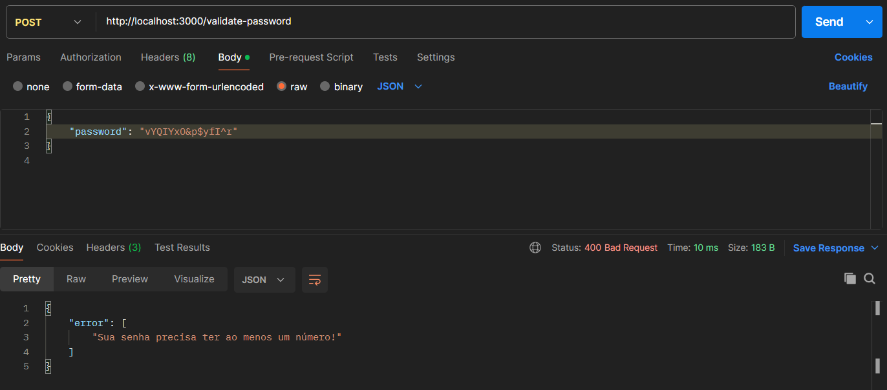

# Secure-password

Esse repositório faz parte de um conjunto de desafios que estão disponíveis no perfil <a href="https://github.com/backend-br/desafios/" target="_blank">backend-br</a>.

## Desafio
Esse desafio consiste em implementar um serviço que valide se uma senha é considerada segura com base nos seguintes critérios:

- Verificar se a senha possui pelo menos 08 caracteres.
- Verificar se a senha contém pelo menos uma letra maiúscula.
- Verificar se a senha contém pelo menos uma letra minúscula.
- Verificar se a senha contém pelo menos um dígito numérico.
- Verificar se a senha contém pelo menos um caractere especial (e.g, !@#$%).

## Request

O serviço irá receber uma requisição utilizando o método _POST_  com a senha que deve ser validada.
```json
{
    "password": "vYQIYxO&p$yfI^r"
}
```

## Response
- `204 No Content`: caso a senha obedeça a todos os critérios.
- `400 Bad Request`: caso a senha não obedeça a todos os critérios.

## Realizando as requisições

### Bad Request


### No Content


## Teconologias utilizadas
- Golang

## Ferramenta para realizar as requisições
- Postman