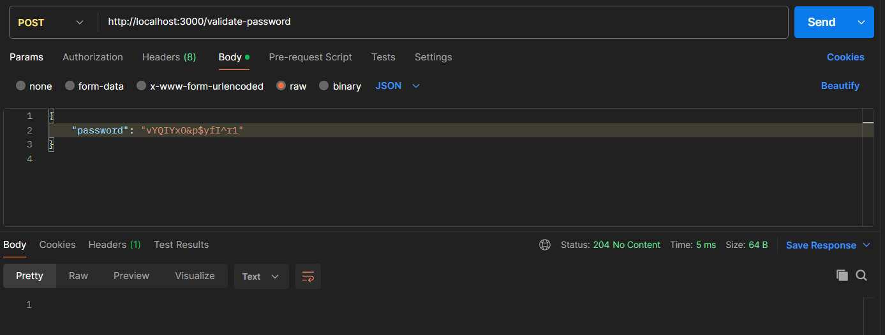

# Secure-password

Esse repositório faz parte de um conjunto de desafios que estão disponíveis no <a href="https://github.com/backend-br/desafios/" target="_blank">backend-br</a>.

Esse desafio consiste em implementar um serviço que valide se uma senha é considerada segura com base nos seguintes critérios.

- A senha deve conter no mínimo 8 caracteres
- A senha deve conter nó mínimo um digito

O serviço irá receber uma requisição com a senha que deve ser validada, da seguinte forma:
```json
{
    "password": "vYQIYxO&p$yfI^r"
}
```

Caso a senha não obedeça a todos os critérios, deverá ser retornado o status `400 Bad Request` junto com um json informando quais critérios não foram atendidos:


Se a senha obedecer a todos os critérios definidos, deverá ser retornado o status `204 No Content`:
